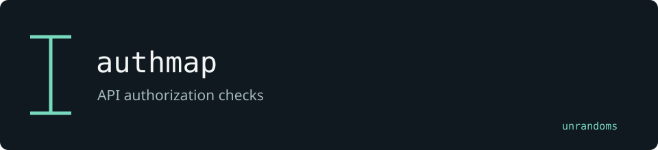

# authmap

Runs an explicit permission matrix against REST APIs and MCP servers. This fork adds a Burp history importer and experimental authorization probes.

Maintained by [unrandoms](https://github.com/unrandoms), derived from [kabiri-labs/overstep](https://github.com/kabiri-labs/overstep).

## Fork-specific work

- [`src/overstep/modules/rest/burp.py`](src/overstep/modules/rest/burp.py)
- [`src/overstep/modules/jwt/idor.py`](src/overstep/modules/jwt/idor.py)
- [`src/overstep/probes/price.py`](src/overstep/probes/price.py)

## Validation and limits

A successful HTTP status alone does not establish an authorization vulnerability. Probe findings need confirmation against the expected access policy.

This documentation update does not certify all inherited features. The [archived reference](UPSTREAM_README.md) describes the original ecosystem; its package names and release links may target upstream rather than this fork.

## Credits

See [CREDITS.md](CREDITS.md) for the distinction between the original implementation and this fork's adaptations. Original licenses and copyright notices remain in the repository.
